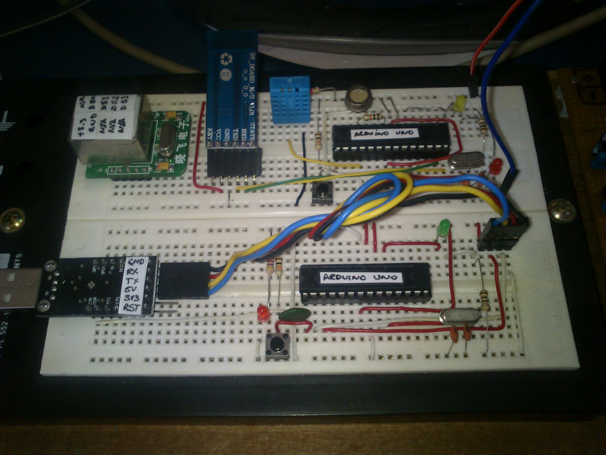
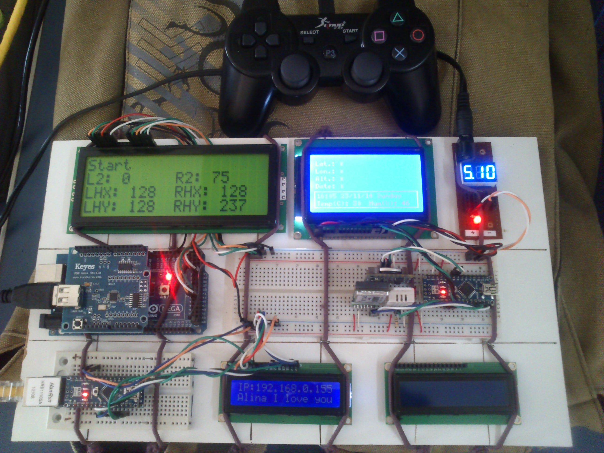
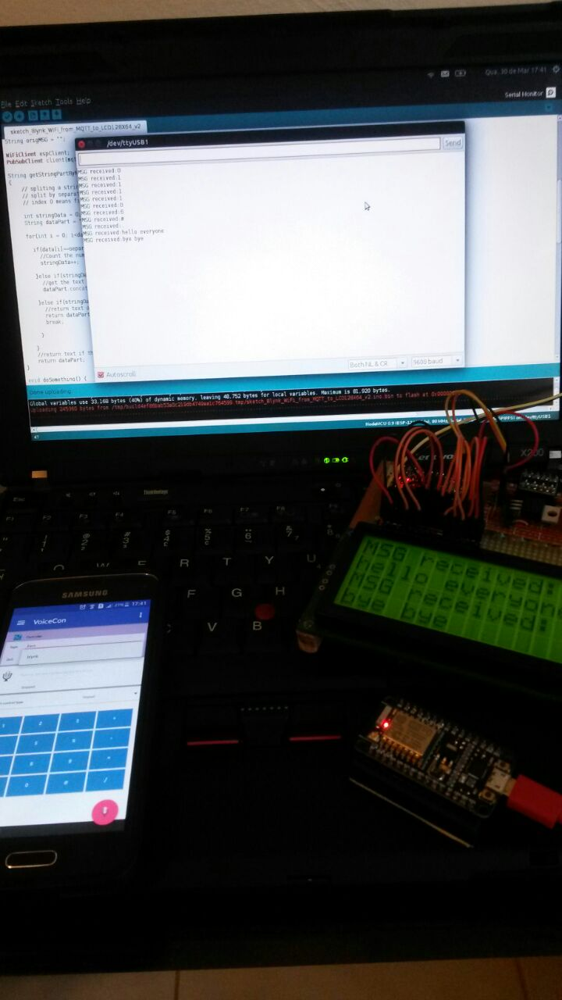
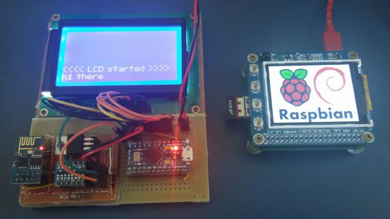
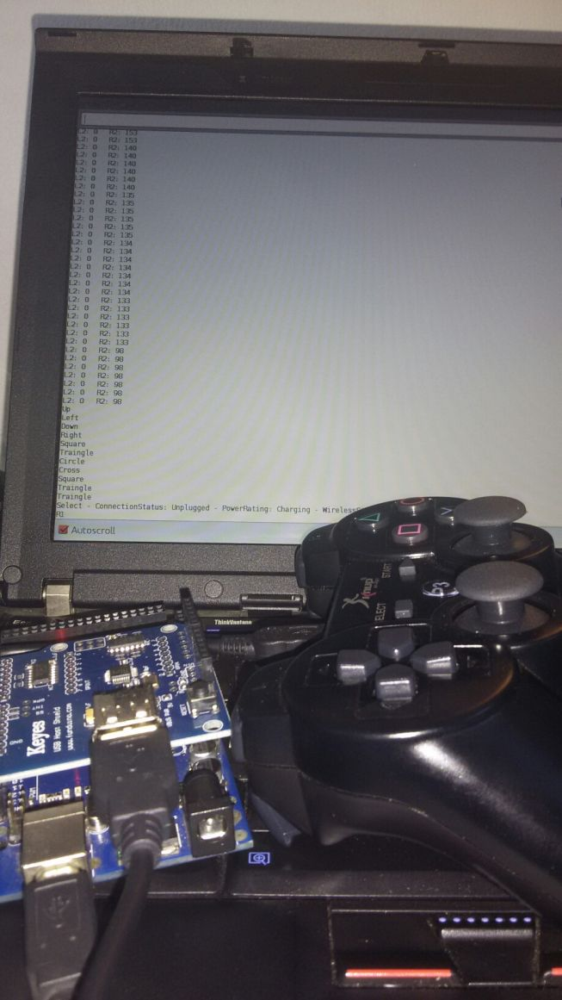
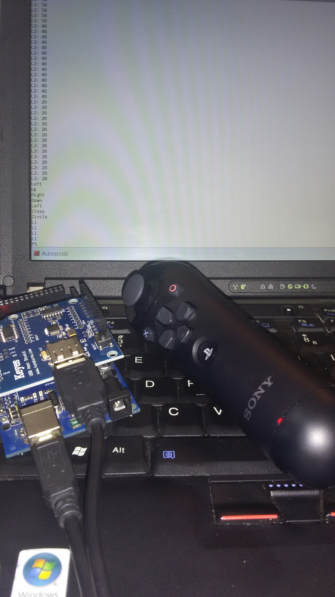
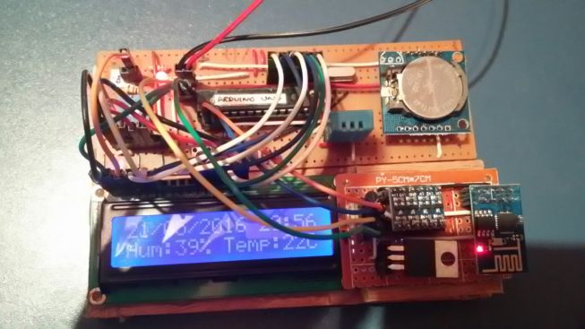
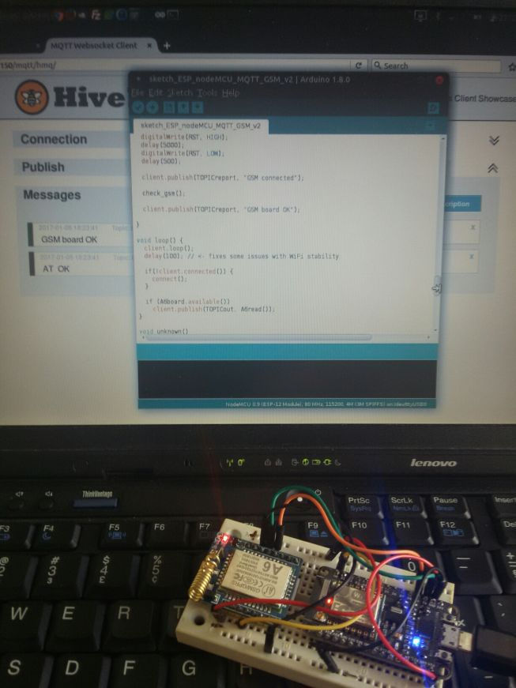
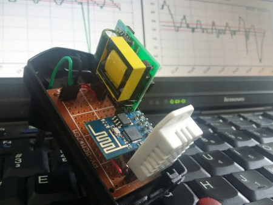

# Old days playing with Arduino boards  

## The fist board was using 2x Arduino chips with a few sensors - just for fun.  

  

## The second board had some more complicated components, like Bluetooth, GPS and LCD board. Uuuuhaaaa!  

  

## The third board was using an Arduino mega board with a USB adapter. So I did a Playstation joystick communication. Also plugged in the intranet.   

## Later, with an even better board, I did a voice integration between Android and Arduino. Somethink like a Google assistant without the assistant. :D     

  

## Some more propjects below   

  
  
  
  
  
  