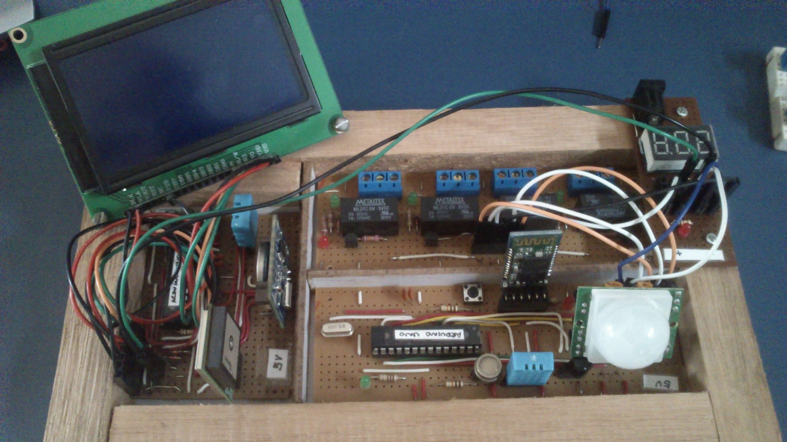

# Old days playing with Arduino boards  

## The fist board was using 2x Arduino chips with some sensors - just for fun.  

  

## The second board had some more complicated components, like Bluetooth, GPS and LCD board. Uuuuhaaaa!  

  

## The third board was using an Arduino mega board with a USB adapter. So I did a Playstation joystick communication. Also plugged in the intranet.   

 

## Later, with an even better board, I did a voice integration between Android and Arduino. Somethink like a Google assistant without the assistant. :D     

  

## Some more projects below   

## An LCD integrated to an MQTT running on RasPI  

  

## 2-hands Joystick adapter  

  

## 1-hand Joystick adapter  

  

## A simple temperature sensor and with a LCD   

  

## Another MQTT board, now in the internet   

  

## A simpler MQTT board with temperature sensor   

  